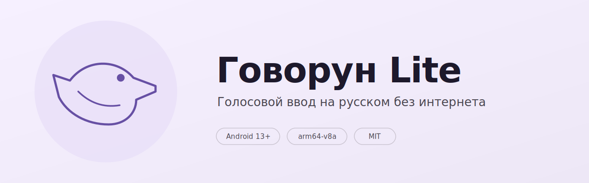

<p align="center">
  
</p>

# Говорун Lite

Голосовой ввод на русском для Android. Работает прямо на телефоне — без
интернета, без аккаунтов, без облака. Звук никуда не отправляется.

Под капотом:

- **[GigaAM v3](https://github.com/salute-developers/GigaAM)** — модель распознавания речи от Сбера, лицензия MIT
- **[sherpa-onnx](https://github.com/k2-fsa/sherpa-onnx)** — нативный ONNX-рантайм
- **[Silero VAD](https://github.com/snakers4/silero-vad)** — офлайновый детектор речевой активности

## Установка

Готовую сборку можно поставить из RuStore:
**[rustore.ru/catalog/app/com.govorun.lite](https://www.rustore.ru/catalog/app/com.govorun.lite)**.
Либо собрать самостоятельно из исходников — см. раздел ниже.

## Как это работает

1. Включаете в настройках специальных возможностей службу Говоруна.
2. Открываете любое поле ввода — сбоку появляется плавающий пузырь.
3. Нажимаете на пузырь — он становится красным, можно говорить.
4. Паузы в речи превращаются в абзацы. Нажали ещё раз — запись
   останавливается, распознанный текст вставляется туда, где курсор.

Один режим, одна кнопка. Ни клавиатуру менять, ни приложение открывать
не надо — пузырь появляется поверх любого поля в любой программе.

## Технические детали

- Минимальная версия Android: 13 (API 33)
- Архитектура: `arm64-v8a`
- Модель GigaAM v3 — ~327 МБ, входит в APK (интернет не нужен)
- Silero VAD — 629 КБ, зашит в APK
- Пакет: `com.govorun.lite`

## Сборка из исходников

```bash
# Один раз — нативный рантайм sherpa-onnx (~47 МБ, в репо не лежит)
./scripts/download-sherpa-onnx.sh

# Один раз — ONNX-модель GigaAM v3 (~327 МБ, в репо не лежит)
./scripts/download-model.sh

# Создать local.properties с путём к Android SDK
echo "sdk.dir=/path/to/android-sdk" > local.properties

./gradlew assembleDebug
adb install --user 0 -r app/build/outputs/apk/debug/app-debug.apk
```

## Установка собранного APK вручную

Если ставите APK в обход магазина (например, скачали готовый файл или
собрали сами и скинули на телефон), Android 13+ требует несколько
дополнительных шагов:

1. **Разрешить установку из неизвестных источников** для того приложения,
   из которого запускаете APK (браузер, файловый менеджер и т. п.).
   Настройки → Приложения → выбранное приложение → «Установка неизвестных
   приложений».

2. **Принять предупреждение Play Protect.** При первом запуске система
   может показать окно «Приложение не проверено». Нажмите «Всё равно
   установить» → «Установить».

3. **Разблокировать ограниченные настройки** (самый неочевидный шаг).
   Android 13+ по умолчанию блокирует Accessibility-сервис у сайдлоадных
   APK. Чтобы открыть доступ:

   - Настройки → Приложения → Говорун
   - Троеточие в правом верхнем углу → «Разрешить ограниченные настройки»
   - Вернитесь в настройки специальных возможностей и включите Говорун

Без третьего шага служба не появится в списке Accessibility вообще.
Через RuStore все эти шаги не нужны — магазин автоматически получает
доверие системы.

## Лицензия

Код приложения — MIT, см. [LICENSE](LICENSE).

Сторонние компоненты и их лицензии перечислены в
[THIRD_PARTY_LICENSES.txt](THIRD_PARTY_LICENSES.txt):

- **GigaAM v3** — модель Сбера, MIT
- **sherpa-onnx** — нативный рантайм, Apache 2.0
- **Silero VAD** — детектор речевой активности, MIT

Тот же файл доступен внутри приложения: «О программе» → «Лицензии».
